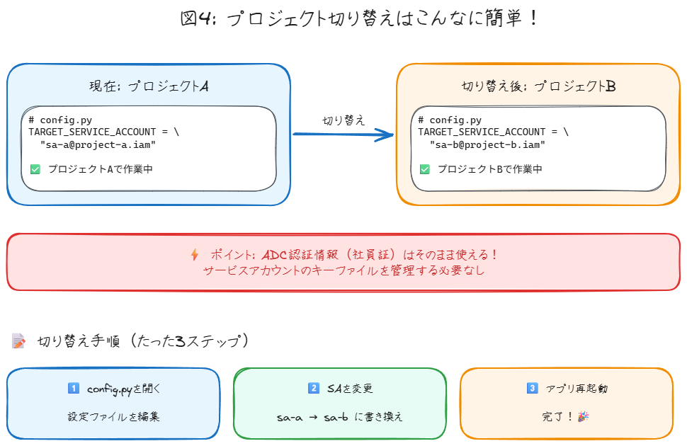
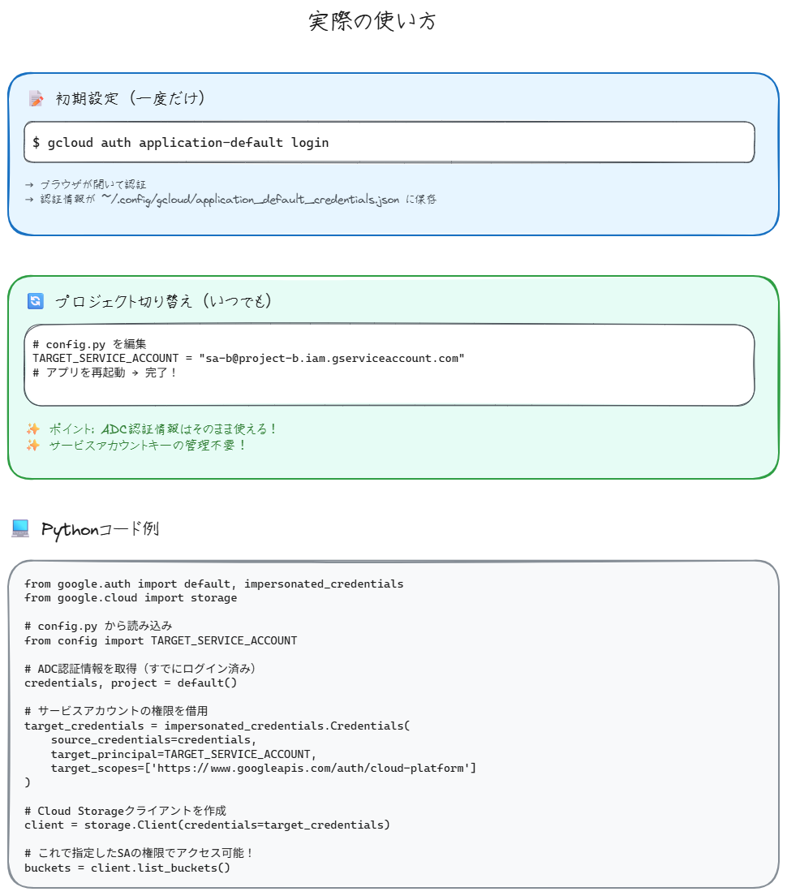

# ADC認証でらくらく複数プロジェクト開発ガイド

> このガイドは[クイックスタートガイド](quickstart.md)の補足資料です。
> まだクイックスタートを読んでいない方は、先にそちらをご覧ください。

クイックスタートで ADC（Application Default Credentials）を設定しましたが、「実際どんな仕組み？」「複数プロジェクトで使うには？」という疑問にお答えします。図解でわかりやすく説明するので、難しそうに見えるADC認証も、実は仕組みさえ分かれば簡単です。

## 📚 なぜADCを詳しく知る必要があるのか？

クイックスタートガイドでは `gcloud auth application-default login` を実行しましたが、実際の開発ではこんな場面に出会います：

- **複数プロジェクトでの作業**: プロジェクトAとプロジェクトBを頻繁に切り替えたい
- **チーム開発**: サービスアカウントのキーファイルをたくさん管理するのが面倒
- **セキュリティ要件**: 企業での開発で、より安全な認証方式が求められる

このガイドでは、クイックスタートで触れた ADC の仕組みを詳しく解説し、実践的な活用方法をお伝えします。


上の図を見てください。開発者がログインして、認証情報が保存される流れが一目で分かりますね。たった3つのステップで準備完了です。

### クイックスタートのおさらい

まず、クイックスタートで設定した内容を振り返りましょう：

1. **サービスアカウント作成**: プログラム専用のGoogleアカウントを作成
2. **ADC設定**: `gcloud auth application-default login` で認証情報を保存
3. **API有効化**: Vertex AI APIを有効にしてサンプルコードを実行

### 実際の開発での登場人物

- **あなた（開発者）**: 個人のGoogleアカウント
- **各プロジェクトのサービスアカウント**: SA-A、SA-Bなど、プロジェクトごとの専用アカウント
- **ADC**: クイックスタートで設定した認証の仕組み
- **IAM Credentials API**: 権限チェックをする番人

## ❓ よくある疑問にお答えします

クイックスタートを終えた皆さんから、よくこんな質問をいただきます：

1. **クイックスタートのADC設定、実際何が起こった？**
2. **複数のプロジェクトで作業するときはどうすればいい？**
3. **従来のキーファイル方式と何が違うの？**
4. **セキュリティ面で本当に安全？**
5. **チーム開発でどう活用すればいい？**

## 📖 Read（仕組みを理解する）

### クイックスタートで設定したADCの正体

クイックスタートで実行した `gcloud auth application-default login` により、あなたの「身分証明書」が発行されました。この身分証明書を使って、いろんなプロジェクトの権限を「借りる」ことができます。

**従来の方式（キーファイル）**:

- プロジェクトA用のキーファイル
- プロジェクトB用のキーファイル
- プロジェクトC用のキーファイル... ← 管理が大変！

**ADC方式（クイックスタートで設定）**:

- あなたの身分証明書1つだけ ← シンプル！


カフェチェーンで考えてみましょう。社員証（ADC）を持っていれば、A店でもB店でも店長として働けます。いちいち各店舗の鍵を持ち歩く必要はありません。

### クイックスタートで何が起こったのか？（8つのステップで解説）

クイックスタートでサンプルコードを実行したとき、裏側でこんな認証フローが動いていました：

```text
【カフェチェーンの例】
あなた = カフェチェーンの正社員
サービスアカウント = 各店舗の店長権限
ADC = 社員証
```


### ステップ1〜2：社員証の発行（クイックスタートで実行済み）

```bash
gcloud auth application-default login
```

クイックスタートで実行したこのコマンドで、あなたの「社員証」が発行されました。
これが `~/.config/gcloud/application_default_credentials.json` に保存されています。

### ステップ3〜4：どの店舗で働くか指定（クイックスタートのサンプルコード）

クイックスタートのサンプルコードでは、環境変数でプロジェクトを指定していました：

```python
# .env ファイルで指定
GCP_PROJECT_ID = "your-project-id"

# サンプルコードで読み込み
PROJECT_ID = os.getenv("GCP_PROJECT_ID")
vertexai.init(project=PROJECT_ID, location=LOCATION)
```

### ステップ5〜7：店長権限の借用

社員証を見せて「今日はA店で店長として働きたい」と申請します。本社（IAM）があなたにその権限があるか確認し、OKなら一時的な店長バッジ（トークン）をもらえます。

### ステップ8：実際の作業

店長バッジを使って、その店舗のレジや在庫管理システム（GCPリソース）を操作できます。

### 複数プロジェクトでの切り替え方法

クイックスタートでは1つのプロジェクトで動かしましたが、別のプロジェクトに切り替えたくなったら？ 簡単です。



1. 環境変数を変更

```bash
# .env ファイルを編集
# GCP_PROJECT_ID="project-a"  # 古い設定
GCP_PROJECT_ID="project-b"    # 新しい設定
```

1. アプリケーションを再起動

たったこれだけ。社員証（ADC）はそのまま使えます。より高度な切り替え方法については、後ほど詳しく説明します。

## 💡 Recite（要点をまとめる）

### クイックスタートで体験したADCのメリット

### ADCのメリット（実感できたはず！）

- **キーファイル不要**: JSON キーファイルをダウンロード・管理する必要なし
- **簡単セットアップ**: `gcloud auth application-default login` 一発で完了
- **安全**: 認証情報がコードに含まれない


上の図を見れば一目瞭然ですね。従来の方法では、キーファイルがどんどん増えていきます。でもADCなら、管理するのは自分の認証情報だけです。

### クイックスタートで完了済みの準備

- ✅ サービスアカウントの作成（「Vertex AI ユーザー」権限付き）
- ✅ `gcloud auth application-default login` の実行
- ✅ Vertex AI API の有効化

### クイックスタート後によくある誤解

- ❌ **誤解**: `gcloud config set project` でプロジェクトを切り替えればサンプルコードも別プロジェクトで動く
- ✅ **正解**: サンプルコードは `.env` ファイルの `GCP_PROJECT_ID` を参照する
- `gcloud config` は `gcloud` コマンド用の設定で、ADCの動作とは別です


この図で分かるように、`gcloud config` と ADC は別々の仕組みです。混同しないように注意しましょう。

## 🔄 実践編：複数プロジェクトでの開発

### クイックスタートから一歩進んだ開発フロー

クイックスタートで基本を理解したので、実際の開発シーンを想定した使い方を見ていきましょう。



### 朝の準備（クイックスタートで完了済み）

```bash
# ADCでログイン（すでに実行済み）
gcloud auth application-default login
```

### プロジェクトAでの作業（クイックスタート方式）

```bash
# .env ファイル
GCP_PROJECT_ID="project-a"
GEMINI_MODEL="gemini-1.5-flash"
```

### プロジェクトBに切り替え（クイックスタート方式）

```bash
# .env ファイルを編集
GCP_PROJECT_ID="project-b"
GEMINI_MODEL="gemini-1.5-flash"
# アプリを再起動
```

### より高度な実装例：サービスアカウント権限借用

クイックスタートでは個人アカウントで直接アクセスしましたが、企業開発ではサービスアカウントの権限を「借用」する方法もあります：

```python
from google.auth import default, impersonated_credentials
from google.cloud import storage

# config.py から読み込み
from config import TARGET_SERVICE_ACCOUNT

# ADC認証情報を取得（すでにログイン済み）
credentials, project = default()

# サービスアカウントの権限を借用
target_credentials = impersonated_credentials.Credentials(
    source_credentials=credentials,
    target_principal=TARGET_SERVICE_ACCOUNT,
    target_scopes=['https://www.googleapis.com/auth/cloud-platform']
)

# Cloud Storageクライアントを作成
client = storage.Client(credentials=target_credentials)

# これで指定したSAの権限でアクセス可能！
buckets = client.list_buckets()
```

簡単でしょう？ 設定ファイルを変更すれば、別のプロジェクトのリソースにアクセスできます。

### セキュリティのチェックポイント

忘れてはいけない重要な点があります。

- あなたのGoogleアカウントに適切な権限が必要
- サービスアカウントごとに「トークン作成者」権限の付与が必須
- トークンは短期間で自動更新される

## まとめ：クイックスタートから次のステップへ

クイックスタートで体験したADC認証は、実は「社員証一枚でいろんな店舗の店長になれる」というシンプルで強力な仕組みでした。


上の図で、ADC認証の全体像をもう一度確認してください。4つのステップと、得られるメリットが整理されています。

**クイックスタートで実現できたこと**:

- キーファイル管理からの解放
- セキュアな認証方式
- 簡単なプロジェクト切り替え（.env ファイル編集のみ）

**さらに高度な使い方**:

- サービスアカウント権限借用によるより厳密な権限管理
- チーム開発での共通設定
- 企業のセキュリティポリシーへの準拠

クイックスタートで基本をマスターしたあなたなら、これらの高度な機能も簡単に使いこなせるはずです。

## 🏃‍♀️ 次のステップ

### クイックスタートを完了した方へ

1. **複数プロジェクトでの実験**: 別のGoogle Cloudプロジェクトでも同じサンプルコードを動かしてみる
2. **チーム開発への応用**: チームメンバーと同じADC方式で開発環境を統一
3. **本格的なアプリケーション開発**: この基盤を使って実際のプロダクトを構築

### まだクイックスタートを試していない方へ

まずは[クイックスタートガイド](quickstart.md)から始めましょう！実際に手を動かしてからこのガイドを読み返すと、より深く理解できるはずです。

ADC認証の世界へようこそ。一度慣れてしまえば、従来のキーファイル管理にはもう戻れません！
