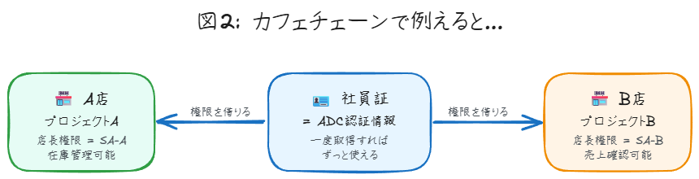

# ADC 認証でらくらく複数プロジェクト開発ガイド

Google Cloud で複数のプロジェクトを切り替えながら開発する方法について、もっとシンプルに理解していきましょう。難しそうに見える ADC 認証も、仕組みさえ分かれば簡単です。

## 📚 Survey（全体像をつかむ）

### そもそも何の話？

Google Cloud で開発していると、こんな悩みに直面しませんか。

- プロジェクト A とプロジェクト B を頻繁に切り替えたい
- サービスアカウントのキーファイルをたくさん管理するのが面倒
- セキュリティも気になる

ADC（Application Default Credentials）という仕組みを使えば、これらの悩みをスッキリ解決できます。

### ADC の「自動」って何が自動なの？

ADC は、お使いのアプリケーションが Google Cloud サービスと連携する際に、認証情報を**自動的に**見つけ出す仕組みです。でも、この「自動的」というのは魔法ではありません。

実は、ADC はあらかじめ決められた順序で認証情報を探しているんです。この順序を理解することが、意図した認証情報を確実に使うための第一歩となります。


上の図を見てください。開発者がログインして、認証情報が保存される流れが一目で分かりますね。たったこれだけで準備完了です。

### 登場人物の整理

話を理解するために、まず登場人物を整理しましょう。

**主要な登場人物**：

- あなた（開発者）の Google アカウント
- 各プロジェクトのサービスアカウント（SA-A、SA-B など）
- ADC という認証の仕組み
- IAM Credentials API という権限チェックをする番人

## ❓ Question（知りたいことを明確に）

この内容を理解するための重要な質問を整理します。

1. **なぜ ADC を使うの？**
2. **どうやって設定するの？**
3. **複数プロジェクトをどう切り替えるの？**
4. **セキュリティは大丈夫？**
5. **従来の方法と何が違うの？**

## 📖 Read（仕組みを理解する）

### ADC が認証情報を探す順番（これ重要！）

ADC は以下の順序で認証情報を検索します。この順序は固定されており、**最初に見つかった有効な認証情報が使用されます**。

1. **`GOOGLE_APPLICATION_CREDENTIALS` 環境変数**
   - この環境変数が設定されている場合、ADC は指定されたパスにある認証情報ファイルを最優先で使用します
   - つまり、他の設定があってもこれが最優先！

2. **`gcloud auth application-default login` で作成された認証情報ファイル**
   - 環境変数が設定されていない場合、次にローカル開発用の認証情報ファイルを探します
   - 通常は `~/.config/gcloud/application_default_credentials.json` にあります

3. **アタッチされたサービスアカウント（Google Cloud 環境のみ）**
   - 上記のどちらもない場合、かつ Google Cloud 上で実行されている場合
   - そのリソースにアタッチされたサービスアカウントの認証情報を使用します

この順序を知らないと「あれ？違う認証情報が使われてる！」なんてことになりかねません。


### ADC の基本的な考え方

ADC は「あなたの身分証明書」のようなものです。一度ログインすれば、その身分証明書を使って、いろんなプロジェクトの権限を「借りる」ことができます。

従来は各プロジェクトごとにサービスアカウントのキーファイル（鍵）を管理していました。でも、ADC を使えば自分の身分証明書だけで済みます。



カフェチェーンで考えてみましょう。社員証（ADC）を持っていれば、A 店でも B 店でも店長として働けます。いちいち各店舗の鍵を持ち歩く必要はありません。

### 認証の流れ（8 つのステップ）

実際の認証の流れを、詳しく見ていきましょう。

```text
【カフェチェーンの例】
あなた = カフェチェーンの正社員
サービスアカウント = 各店舗の店長権限
ADC = 社員証
```


**ステップ 1〜2：社員証の発行**：

```bash
gcloud auth application-default login
```

このコマンドで、あなたの「社員証」が発行されます。これが `~/.config/gcloud/application_default_credentials.json` に保存されます。

**重要な注意点**：このコマンドを実行する前に、必ず `gcloud init` で Google Cloud SDK の初期設定を完了させてください。

**ステップ 3〜4：どの店舗で働くか指定**
アプリケーションのコードで、今日働く店舗（サービスアカウント）を指定します。

```python
# 例：プロジェクト A で作業する場合
target_sa = "sa-a@project-a.iam.gserviceaccount.com"
```

**ステップ 5〜7：店長権限の借用**
社員証を見せて「今日は A 店で店長として働きたい」と申請します。本社（IAM）があなたにその権限があるか確認し、OK なら一時的な店長バッジ（トークン）をもらえます。

**ステップ 8：実際の作業**
店長バッジを使って、その店舗のレジや在庫管理システム（GCP リソース）を操作できます。

### gcloud auth login と何が違うの？

ここ、よく混乱するポイントです！

- **`gcloud auth login`**：gcloud コマンドライン自体を認証（CLI で gcloud コマンドを使うため）
- **`gcloud auth application-default login`**：あなたのアプリケーションを認証（コードが API を呼ぶため）

両者は**別々の認証情報ファイル**を使います。「gcloud auth login したのにコードが動かない！」というのは、この違いが原因かもしれません。

### プロジェクトの切り替え方

B 店に移動したくなったら？ 簡単です。


1. アプリケーションの設定を変更

   ```python
   # target_sa = "sa-a@project-a.iam.gserviceaccount.com"  # 古い設定
   target_sa = "sa-b@project-b.iam.gserviceaccount.com"    # 新しい設定
   ```

2. アプリケーションを再起動

たったこれだけ。社員証（ADC）はそのまま使えます。

### サービスアカウントキーは使っちゃダメ？

`GOOGLE_APPLICATION_CREDENTIALS` 環境変数にサービスアカウントのキーファイル（JSON）を指定する方法もありますが . . .

**⚠️ 重要な警告：この方法はセキュリティ上の大きなリスクを伴うため、Google Cloud では推奨されていません！**

なぜ危険なのでしょうか。

- キーファイルが漏洩すると、第三者が不正利用できてしまいます
- キーの管理が煩雑で、ローテーションも手動です
- 削除し忘れたキーが残り続けるリスクがあります

じゃあ、どうすればいいの？ より安全な代替手段があります。

- **ローカル開発**：`gcloud auth application-default login` を使う
- **オンプレミスや他のクラウド**：Workload Identity Federation を使う
- **Google Cloud 上**：アタッチされたサービスアカウントを使う（次で説明）

## 💡 Recite（要点をまとめる）

### Google Cloud 上での推奨方法

Google Cloud 上でアプリケーションを実行する場合（Compute Engine、Cloud Run、Cloud Run functions など）、**最も推奨される認証方法は、リソースにサービスアカウントをアタッチすることです**。

なぜこれが最善なのでしょうか。

- 認証情報が自動的に管理される（キーファイル不要）
- Google が自動的にトークンをローテーション
- メタデータサーバー経由で安全に取得

### 最小権限の原則（超重要！）

サービスアカウントを使う際の鉄則があります。それは**最小権限の原則**です。

例えば、Cloud Storage からファイルを読むだけのアプリなら。

- ❌ プロジェクト「編集者」や「オーナー」権限
- ✅ 「ストレージオブジェクト閲覧者」権限のみ

なぜこれが重要なのか？ 万が一アプリケーションが侵害されても、被害を最小限に抑えられるからです。


上の図を見れば一目瞭然ですね。従来の方法では、キーファイルがどんどん増えていきます。でも ADC なら、管理するのは自分の認証情報だけです。

**必要な準備**：

- 各サービスアカウントに対する「サービスアカウントトークン作成者」権限
- `gcloud auth application-default login` の実行

**よくある誤解**：

- `gcloud config set project` は ADC の動作に直接影響しません
- これは `gcloud` コマンド用の設定です


この図で分かるように、`gcloud config` と ADC は別々の仕組みです。混同しないように注意しましょう。

## 🔄 Review（実践的な使い方）

### 実際の開発フロー

日常的な開発では、こんな流れになります。


**朝の準備（初回のみ）**：

```bash
# Google Cloud SDK の初期設定（未実施の場合）
gcloud init

# ADC でログイン
gcloud auth application-default login
```

**プロジェクトAでの作業**：

```python
# config.py
TARGET_SERVICE_ACCOUNT = "sa-a@project-a.iam.gserviceaccount.com"
```

**プロジェクトBに切り替え**：

```python
# config.py を編集
TARGET_SERVICE_ACCOUNT = "sa-b@project-b.iam.gserviceaccount.com"
# アプリを再起動
```

### Pythonでの実装例

実際のコードを見てみましょう。

```python
from google.auth import default, impersonated_credentials
from google.cloud import storage

# config.py から読み込み
from config import TARGET_SERVICE_ACCOUNT

# ADC 認証情報を取得（すでにログイン済み）
credentials, project = default()

# サービスアカウントの権限を借用
target_credentials = impersonated_credentials.Credentials(
    source_credentials=credentials,
    target_principal=TARGET_SERVICE_ACCOUNT,
    target_scopes=['https://www.googleapis.com/auth/cloud-platform']
)

# Cloud Storage クライアントを作成
client = storage.Client(credentials=target_credentials)

# これで指定した SA の権限でアクセス可能！
buckets = client.list_buckets()
```

簡単でしょう？ 設定ファイルを変更すれば、別のプロジェクトのリソースにアクセスできます。

### Vertex AI Gemini API を使う場合の注意点

Vertex AI Gemini API を使う場合、少し追加の考慮が必要です。

```python
from google.auth import default
import google.auth.transport.requests

# ADC から認証情報を取得
credentials, project = default(
    scopes=['https://www.googleapis.com/auth/cloud-platform']
)

# トークンが期限切れの場合は更新
if not credentials.valid:
    request = google.auth.transport.requests.Request()
    credentials.refresh(request)

# アクセストークンを取得
access_token = credentials.token
```

**⏰ 重要：トークンの有効期限は 1 時間です！**

長時間動くアプリケーションでは、トークンの更新が必要になります。以下のようなヘルパークラスを使うと便利です。

```python
class TokenRefresher:
    def __init__(self, credentials):
        self.credentials = credentials
        
    def get_valid_token(self):
        if not self.credentials.valid:
            request = google.auth.transport.requests.Request()
            self.credentials.refresh(request)
        return self.credentials.token
```

### セキュリティのチェックポイント

忘れてはいけない重要な点があります。

- あなたの Google アカウントに適切な権限が必要
- サービスアカウントごとに「トークン作成者」権限の付与が必須
- トークンは短期間で自動更新される

## まとめ

ADC を使った複数プロジェクト開発は、最初は複雑に見えるかもしれません。でも実際は「社員証一枚でいろんな店舗の店長になれる」というシンプルな仕組みです。


上の図で、ADC 認証の全体像をもう一度確認してください。4 つのステップと、得られるメリットが整理されています。

キーファイルをたくさん管理する必要もなく、セキュリティも向上します。一度設定してしまえば、プロジェクトの切り替えは設定ファイルの変更だけ。

## どの方法を使うべき？（意思決定ガイド）

状況に応じて最適な方法を選びましょう。

**Google Cloud上で動かす場合**
→ アタッチされたサービスアカウントを使う（最も安全）

**ローカルで開発する場合**
→ `gcloud auth application-default login` を使う

**オンプレミスや他のクラウドから接続する場合**
→ Workload Identity Federation を検討

**どうしてもキーファイルが必要な場合（レガシーシステムなど）**
→ 最終手段として使用し、厳重に管理する


これで、複数の Google Cloud プロジェクトをスマートに切り替えながら開発できるようになりました。難しく考えすぎず、まずは試してみてください。きっと開発がもっと楽になるはずです。


## 🏃‍♀️ 次のステップ

実際に手を動かしてみませんか。

1. まずは `gcloud init` と `gcloud auth application-default login` を実行
2. 簡単な Python スクリプトで動作確認
3. 徐々に複雑な操作にチャレンジ

最初は戸惑うかもしれませんが、一度慣れてしまえばもう戻れません。従来のキーファイル管理がいかに面倒だったか実感するはずです。

頑張ってください！
